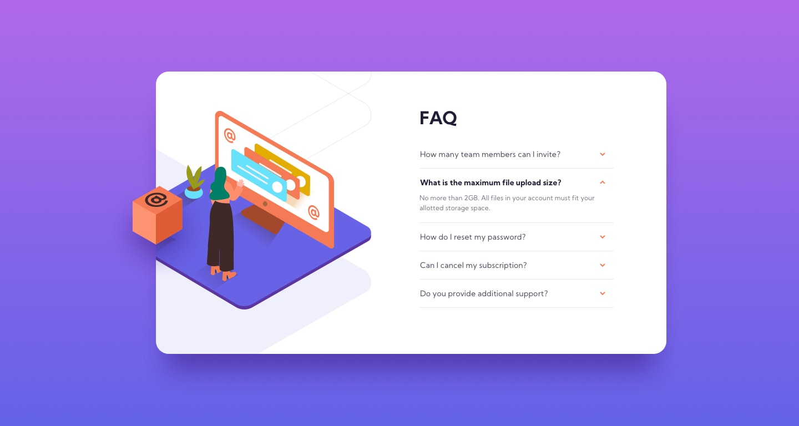

# Frontend Mentor - FAQ accordion card solution

This is a solution to the [FAQ accordion card challenge on Frontend Mentor](https://www.frontendmentor.io/challenges/faq-accordion-card-XlyjD0Oam). Frontend Mentor challenges help you improve your coding skills by building realistic projects. 

## Table of contents

- [Overview](#overview)
  - [The challenge](#the-challenge)
  - [Screenshot](#screenshot)
  - [Links](#links)
  - [Built with](#built-with)
- [Author](#author)

## Overview

### The challenge

Users should be able to:

- View the optimal layout for the component depending on their device's screen size
- See hover states for all interactive elements on the page
- Hide/Show the answer to a question when the question is clicked

### Screenshot

### Links

- Solution URL: [https://lucid-cray-b4e625.netlify.app](https://lucid-cray-b4e625.netlify.app)
- Live Site URL: [https://github.com/skyrimer/FAQ-accordion-card](https://github.com/skyrimer/FAQ-accordion-card)

### Built with

- HTML5
- SCSS
- Flexbox
- Mobile-first workflow
## Author

- Website - [Kirill Chekmenev](https://xenodochial-clarke-834e2f.netlify.app)
- Frontend Mentor - [@skyrimer](https://www.frontendmentor.io/profile/skyrimer)
- Instagram - [@silent_kirill](https://www.instagram.com/silent_kirill/)